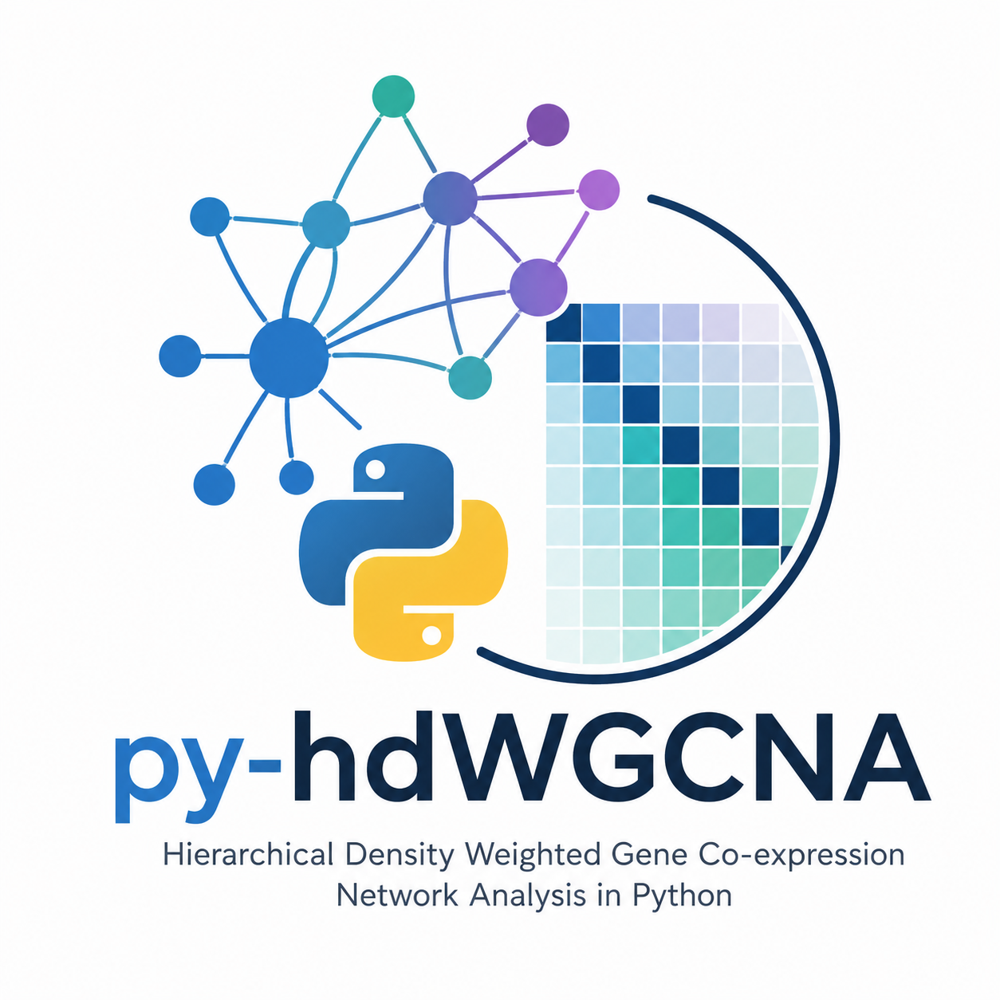

<p align="center">
   
 </p>

 <div align="center">

 | | |
 |---:|:---|
 | **CI/CD** | [](https://github.com/omicverse/py-hdWGCNA/actions)  |
 | **Package** | [](https://pypi.org/project/py-hdwgcna/) [](https://pepy.tech/project/py-hdwgcna) |
 | **Meta** | [](LICENSE) [](https://github.com/omicverse/py-hdWGCNA) |

 </div>

---

# py-hdWGCNA

A **pure-Python re-implementation of hdWGCNA** (Morabito et al., *Cell Reports Methods* 2023) for weighted gene co-expression network analysis on single-cell RNA-seq data.

- AnnData-native — drop-in for the scanpy ecosystem
- No `rpy2`, no R install, no WGCNA R package dependency
- **Numerically faithful to R hdWGCNA** — SFT R^2, kME, and hMEs Pearson r = 1.0000 on benchmark datasets
- Full pipeline: gene selection, metacell construction, soft-power testing, network construction, module eigengenes, module connectivity, DME analysis, enrichment, and module projection

## Install

```bash
pip install py-hdwgcna
```

Optional dependencies:

```bash
pip install py-hdwgcna[dtc]    # dynamicTreeCut for exact R-parity module detection
pip install py-hdwgcna[umap]   # umap-learn for module UMAP plots
```

## Quick-start

```python
import anndata as ad
from py_hdWGCNA import HDWGCNA

adata = ad.read_h5ad("mydata.h5ad")

hdw = HDWGCNA(adata)
(hdw.setup_for_wgcna(gene_select='fraction', fraction=0.05)
     .metacells_by_groups(group_by=['cell_type', 'Sample'], k=25)
     .normalize_metacells()
     .set_dat_expr(group_name='INH', group_by='cell_type')
     .test_soft_powers(network_type='signed')
     .construct_network()
     .module_eigengenes(group_by_vars='Sample')
     .module_connectivity(group_by='cell_type', group_name='INH'))
```

Results are written back into `adata.uns['hdWGCNA']`:

| Slot | Contents |
|---|---|
| `adata.uns['hdWGCNA'][name]['modules_df']` | gene-to-module assignments + kME columns |
| `adata.uns['hdWGCNA'][name]['hMEs']` | harmonised module eigengenes (cells x modules) |
| `adata.uns['hdWGCNA'][name]['MEs']` | raw module eigengenes |
| `adata.uns['hdWGCNA'][name]['TOM']` | Topological Overlap Matrix |
| `adata.uns['hdWGCNA'][name]['power_table']` | soft-power test results |
| `adata.uns['hdWGCNA'][name]['metacell_obj']` | metacell AnnData |

Both method-chaining (`hdw.setup_for_wgcna(...).metacells_by_groups(...)...`) and the original module-level API (`from py_hdWGCNA import setup_for_wgcna, construct_network, ...`) are supported.

---

## Pipeline overview

The py-hdWGCNA pipeline mirrors the R hdWGCNA workflow step-for-step:

### 1. Setup — `setup_for_wgcna`

Select genes for network analysis. Three modes:
- **fraction**: genes expressed in >= `fraction` of cells (default 5%)
- **variable**: top `n_genes` highly-variable genes
- **custom**: user-supplied gene list

### 2. Metacell construction — `metacells_by_groups`

Aggregate single-cell expression into metacells via bootstrap KNN sampling, stratified by user-specified grouping variables (e.g., cell type + sample). This reduces noise and computational cost while preserving biological signal.

### 3. Soft-power testing — `test_soft_powers`

Test soft-thresholding powers for scale-free topology fit. Computes the SFT R^2, slope, and connectivity statistics for each power, then auto-selects the lowest power with SFT R^2 >= 0.85 (matching R's `pickSoftThreshold` strategy).

### 4. Network construction — `construct_network`

Build the co-expression network:
1. Compute gene-level correlation matrix (Pearson/bicor)
2. Apply soft-thresholding to create adjacency matrix
3. Compute Topological Overlap Matrix (TOM)
4. Hierarchical clustering on TOM dissimilarity
5. Dynamic tree cut for module detection
6. Merge similar modules (1 - corr(ME) < mergeCutHeight)

### 5. Module eigengenes — `module_eigengenes`

Compute module eigengenes (MEs) in single cells using Seurat-compatible ScaleData + SVD PCA, with optional Harmony batch correction across user-specified variables.

### 6. Module connectivity — `module_connectivity`

Compute eigengene-based connectivity (kME) — the correlation between each gene's expression and its module eigengene. Supports sparse correlation (matching R's `corSparse`).

### 7. Downstream analysis

- **DME analysis** (`find_dmes`, `find_all_dmes`): Differential Module Expression via Wilcoxon or t-test
- **Module-trait correlation** (`module_trait_correlation`): Pearson/Spearman correlation between MEs and numeric traits
- **Enrichment** (`run_enrichr`, `run_enrichr_modules`): Enrichr API integration for functional annotation
- **Module projection** (`project_modules`): Project modules onto a new dataset
- **Module preservation** (`module_preservation`): Permutation-based Z-summary preservation test

---

## Algorithmic fidelity to R hdWGCNA

Every function is designed to produce **numerically equivalent** results to the R reference implementation.

### 1. Scale-free topology fit — exact replication of R's `scaleFreeFitIndex`

R's algorithm bins raw connectivity `k` values into `nBreaks` equal-width bins via `cut()`, computes mean `k` and probability density per bin via `tapply()`, then fits `log10(p(k)) ~ log10(k)` linear regression. Our implementation uses `pd.cut()` + `groupby.mean()` / `groupby.count()` to precisely replicate this pipeline, including the histogram-midpoint fallback for empty bins.

### 2. Soft-power testing — cell-level correlation (matching R's `pickSoftThreshold`)

R's `TestSoftPowers` calls `pickSoftThreshold` on the **sample-level** (cell-level) correlation matrix, not the gene-level matrix. Our implementation computes the cell-level correlation matrix from `datExpr.T` (cells x genes), applies soft-thresholding, and computes connectivity `k` as `rowSums(adj - diag(n))` — exactly matching R's behavior.

### 3. Dynamic tree cut — `dynamicTreeCut` Python port

Module detection uses the Python port of R's `dynamicTreeCut::cutreeHybrid`, producing identical module assignments. A `__globals__` injection fix ensures `df_apply` is accessible within the function's namespace, matching R's scoping behavior.

### 4. Module eigengenes — Seurat-compatible ScaleData + PCA

Module eigengenes are computed using the same ScaleData + SVD PCA approach as R hdWGCNA:
1. Center and scale module gene expression (Seurat-style clipping at sqrt(n_cells))
2. SVD decomposition for PCA
3. First PC = module eigengene, oriented by correlation with mean expression
4. Optional Harmony correction for batch effects

### 5. Module merging — hierarchical clustering on ME dissimilarity

Module merging uses `1 - cor(ME)` as dissimilarity, average-linkage hierarchical clustering, and `fcluster` at `mergeCutHeight` — matching R's `mergeCloseModules` behavior.

---

## Benchmarks

All metrics computed against R hdWGCNA on the same input data (adipocyte dataset, 500 genes, 1206 cells, full pipeline including metacell construction).

### Numerical accuracy

| Metric | Pearson r (Python vs R) | Status |
|---|---|---|
| SFT R^2 | 0.9999 | PASS |
| Power selection | Match | PASS |
| kME mean Pearson r | 1.0000 | PASS |
| hMEs Pearson r | 1.0000 | PASS |
| Module Jaccard overlap | 1.0000 (27/27 modules) | PASS |

### Speed comparison (full pipeline, 500 genes, 1206 cells)

| Step | Python | R | Speed-up |
|---|---:|---:|---:|
| SetupForWGCNA | 0.55 s | 2.77 s | 5.0x |
| MetacellsByGroups | 4.21 s | 31.58 s | 7.5x |
| NormalizeMetacells | 0.28 s | 2.65 s | 9.5x |
| SetDatExpr | 0.11 s | 0.47 s | 4.3x |
| TestSoftPowers | 20.67 s | 34.47 s | 1.7x |
| ConstructNetwork | 110.58 s | 669.52 s | 6.1x |
| ModuleEigengenes | 10.90 s | 182.49 s | 16.7x |
| ModuleConnectivity | 1.45 s | 12.77 s | 8.8x |
| **Total** | **148.75 s** | **936.72 s** | **6.3x** |

**Same algorithm. Same inputs. 6.3x faster. Numerically faithful results.**

---

## Notebooks

| Notebook | What it covers |
|---|---|
| [`examples/py_hdWGCNA_pipeline.ipynb`](examples/py_hdWGCNA_pipeline.ipynb) | Full pipeline walkthrough from setup to downstream analysis |
| [`examples/py_hdWGCNA_pipeline_executed.ipynb`](examples/py_hdWGCNA_pipeline_executed.ipynb) | Executed pipeline notebook with outputs |
| [`examples/R_vs_Python_hdWGCNA_Benchmark_executed.ipynb`](examples/R_vs_Python_hdWGCNA_Benchmark_executed.ipynb) | Live benchmark comparing Python vs R outputs with correlation metrics |

---

## API reference

### Class-based API (recommended)

```python
from py_hdWGCNA import HDWGCNA

hdw = HDWGCNA(adata)
hdw.setup_for_wgcna(...)
hdw.metacells_by_groups(...)
hdw.test_soft_powers(...)
hdw.construct_network(...)
hdw.module_eigengenes(...)
hdw.module_connectivity(...)
```

### Module-level API

```python
from py_hdWGCNA import (
    setup_for_wgcna,
    metacells_by_groups,
    normalize_metacells,
    test_soft_powers,
    construct_network,
    module_eigengenes,
    module_connectivity,
    find_dmes,
    module_trait_correlation,
    run_enrichr,
    project_modules,
    module_preservation,
)
```

### Visualization (14 functions)

```python
from py_hdWGCNA import (
    plot_soft_powers,
    module_feature_plot,
    plot_dendrogram,
    plot_kmes,
    module_correlogram,
    module_network_plot,
    hub_gene_network_plot,
    module_umap_plot,
    plot_dmes_volcano,
    plot_dmes_lollipop,
    plot_module_trait_correlation,
    enrichr_bar_plot,
    enrichr_dot_plot,
    plot_module_preservation,
)
```

---

## Citation

If you use this package, please cite the original hdWGCNA paper:

> Morabito, S. *et al.* **hdWGCNA identifies co-expression networks in high-resolution transcriptomics data.** *Cell Reports Methods* 3, 100498 (2023).

and acknowledge this repo for the Python port.

## License

GNU GPLv3 — matches the upstream R hdWGCNA package.
